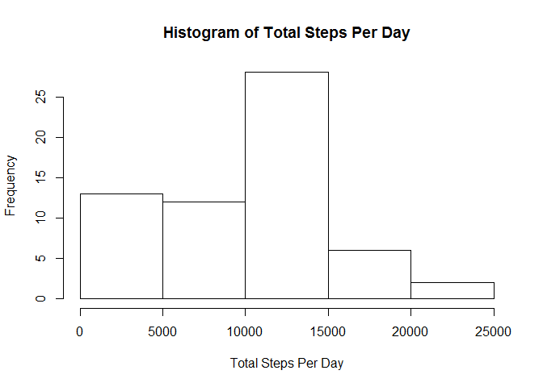
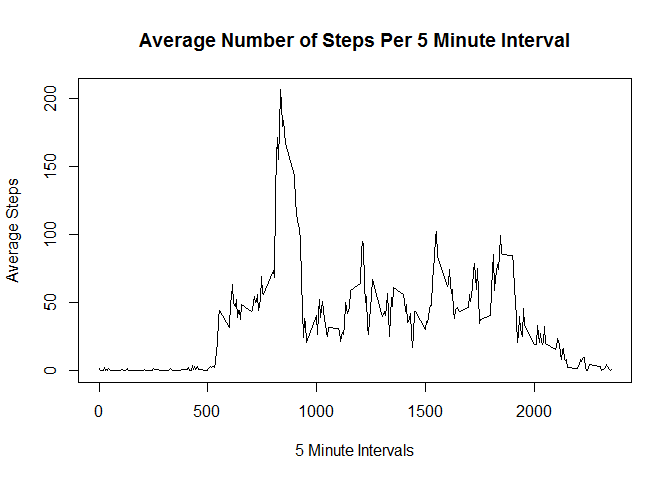
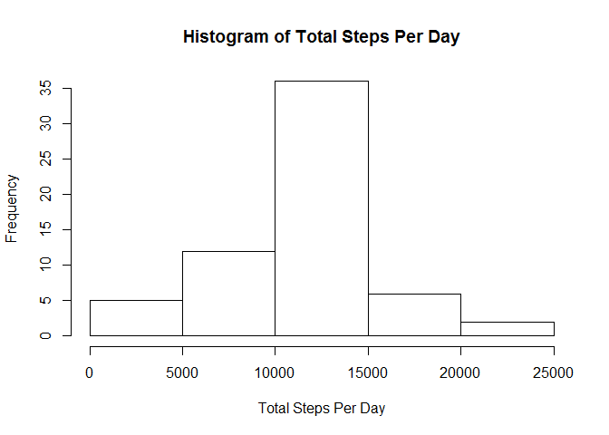
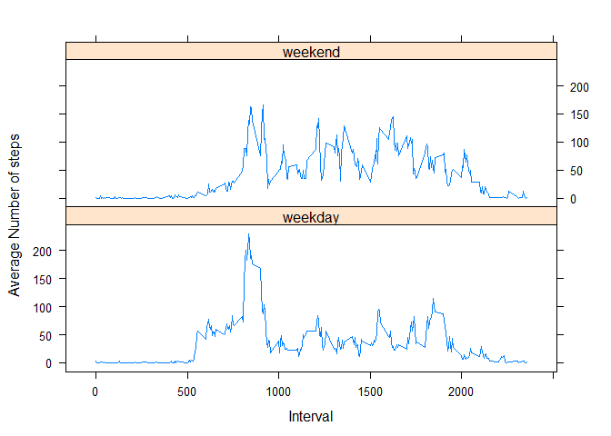

# Reproducible Research: Peer Assessment 1

## Loading and preprocessing the data


```r
### Load required libraries
library(dplyr)
```

```
## Warning: package 'dplyr' was built under R version 3.1.2
```

```r
library(lattice)
#Read in data
dataset <- read.csv (file="activity/activity.csv", header=TRUE, sep=",", stringsAsFactors = FALSE)
#Convert character to date
dataset$date <- as.Date(dataset$date)
#Convert data frame to data table for using dplyr package
dataset <- tbl_df (dataset)
```

## What is mean total number of steps taken per day?


```r
#Use group_by in dplyr to group by date and sum the total steps for each date
GroupStepsByDate <- group_by(dataset, date) %>%
        summarise(sum(steps, na.rm=TRUE))
#Assign sensible headers to the grouped data
names(GroupStepsByDate) <- c("Date", "TotalSteps")
#Create historgram of the total number of steps taken each day
hist(GroupStepsByDate$TotalSteps, xlab="Total Steps Per Day", main="Histogram of Total Steps Per Day")
```

 

The mean and median total number of steps taken is as below:

```r
mean(GroupStepsByDate$TotalSteps)
```

```
## [1] 9354.23
```

```r
median(GroupStepsByDate$TotalSteps)
```

```
## [1] 10395
```

## What is the average daily activity pattern?


```r
#Group by interval and calculate average
GroupStepsByInterval <- group_by(dataset, interval) %>%
        summarise(mean(steps, na.rm=TRUE))
names(GroupStepsByInterval) <- c("Interval", "AvgSteps")
#Make a line plot of this data
plot(GroupStepsByInterval$Interval, GroupStepsByInterval$AvgSteps, type="l", main="Average Number of Steps Per 5 Minute Interval", xlab="5 Minute Intervals", ylab="Average Steps")
```

 

On average, the interval with the maximum number of steps per day is as below:

```r
filter(GroupStepsByInterval, AvgSteps==max(AvgSteps))
```

```
## Source: local data frame [1 x 2]
## 
##   Interval AvgSteps
## 1      835 206.1698
```

## Imputing missing values

There are a number of rows containing missing data in the dataset which may introduce bias to the results. In total, the number of values missing is: 

```r
#Count NA values of the steps variable
length(which(is.na(dataset$steps)))
```

```
## [1] 2304
```

To overcome this limitation, data has been imputed into this missing values. The approach taken for this analysis is to use the mean for that five minute interval in place of the NA value. This was achieved using the following code. Note the impact this change makes on the histogram of total steps per day below.


```r
#Create imputed dataset
ImputedDataset <- dataset
#Add imputed values by matching them from the table containing average steps per interval
ImputedDataset$ImputedSteps <- GroupStepsByInterval$AvgSteps[match(GroupStepsByInterval$Interval, ImputedDataset$interval)]
#When the steps value is NA replace this with the imputed value
ImputedDataset$steps[is.na(ImputedDataset$steps)] <- ImputedDataset$ImputedSteps[is.na(ImputedDataset$steps)]
#Remove the temporary imputed column
ImputedDataset$ImputedSteps <- NULL
```


```r
#Use group_by in dplyr to group by date and sum the total steps for each date
GroupStepsByDate <- group_by(ImputedDataset, date) %>%
        summarise(sum(steps, na.rm=TRUE))
#Assign sensible headers to the grouped data
names(GroupStepsByDate) <- c("Date", "TotalSteps")
#Create historgram of the total number of steps taken each day
hist(GroupStepsByDate$TotalSteps, xlab="Total Steps Per Day", main="Histogram of Total Steps Per Day")
```

 

The updated mean and median total number of steps taken is as below using the imputed data. When using imputed data the histogram takes a more normal distribution appearance. This change also results in the mean and the median of the total steps per day becoming the same value and a little higher than in the initial analysis. 


```r
mean(GroupStepsByDate$TotalSteps)
```

```
## [1] 10766.19
```

```r
median(GroupStepsByDate$TotalSteps)
```

```
## [1] 10766.19
```

## Are there differences in activity patterns between weekdays and weekends?

A new day of the week variable is added to the imputed data set along with a new factor variable to denote if the row of data was taken on a weekday or at the weekend.

```r
ImputedDataset$day <- weekdays(ImputedDataset$date)
ImputedDataset$TimeOfWeek <- ifelse(ImputedDataset$day == "Saturday" | ImputedDataset$day == "Sunday", "weekend", "weekday")
ImputedDataset$TimeOfWeek <- as.factor(ImputedDataset$TimeOfWeek)
```

Next, create data broken down by time of week and averages and plot as a time series on a panel plot as below.

```r
updatedGroupStepsByInterval <- group_by(ImputedDataset, TimeOfWeek, interval) %>%
        summarise(mean(steps, na.rm=TRUE))
names(updatedGroupStepsByInterval) <- c("TimeOfWeek", "Interval", "AvgSteps")
updatedGroupStepsByInterval$TimeOfWeek <- as.factor(updatedGroupStepsByInterval$TimeOfWeek)

xyplot(updatedGroupStepsByInterval$AvgSteps ~ updatedGroupStepsByInterval$Interval  | updatedGroupStepsByInterval$TimeOfWeek, type = "l",layout = c(1, 2), xlab = "Interval", ylab = "Average Number of steps")
```

 
